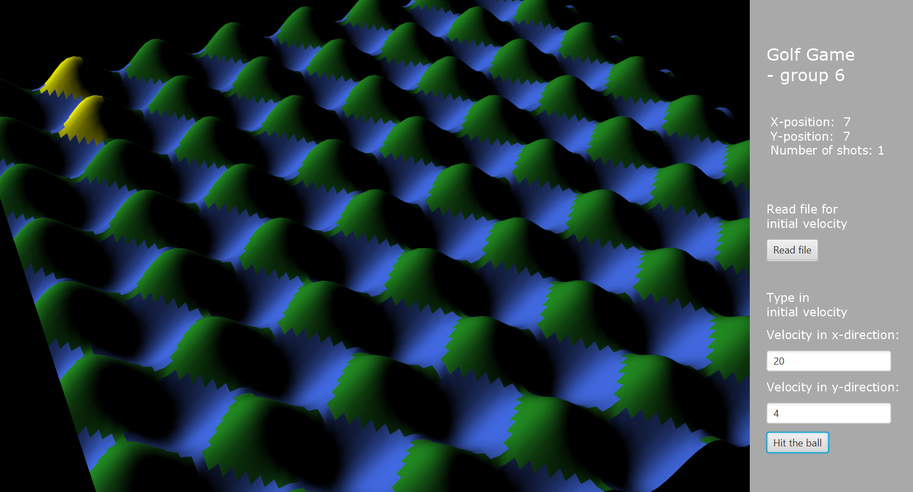

## Crazy putting

***
### Description

The aim of the project is to simulator for putting on sloping greens with obstacles.
The program approximates the physics of real-life putting.
In each game player tries to shoot the ball to the target entering the velocity for the ball.

### Instruction

- #### Moving around the scene
  - rotate around the scene using mouse (click and drag the frame).
  - zoom-in and zoom-out by using the mouse wheel.
  - You can also navigate around the scene using the keyboard.

- #### Playing the game
  - once game is loaded all the values for the game scene are read from the file _inputFile.txt_.
  
  - on the right panel we placed two boxes to enter the initial velocity of the ball.
  Feel them in with the integer values and press _Hit the ball_ button in order to trigger the ball movement.
  
  - In case the textBoxes were not filled initial velocity will be read from the file _shot.txt_.

  - You can also shoot the ball with the mouse! Draw the arrow on the canvas at the right-hand side and shoot the ball when releasing the mouse. 

  - once the ball hits the water it is respawned at the closest position on the grass field.
  - click the _Reset ball_ button to bring the ball back to the initial position.
***

### Group 6

* Emre Karabulut
* Gijs Theeuwen
* Keren Better
* Yu Fei
* Yasune Notermans
* Haomin Bian
* Maja Gójska
